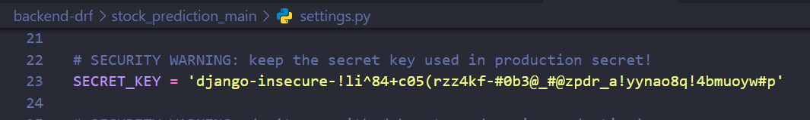
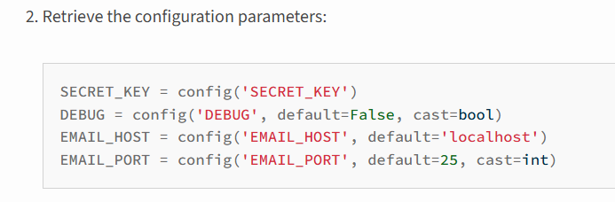

##  Start a New Django project
```
django-admin startproject stock_prediction_main .
```
## Storing secret key


To store the above secret key so that it doesnt get exposed in github we install python-decouple
`pip install python-decouple`  

import config from decouple in the `settings.py` of main project  

> from decouple import config

store the secret key inside the .env file  
> SECRET_KEY = " "

python-decouple configuration

here the cast means datatype which is bool

Replace the DEBUG=True value from the settings with the DEBUG=True code provided from the python-decouple docs
>DEBUG = config('DEBUG', default=False, cast=bool)

add `DEBUG=True` in the .env file

